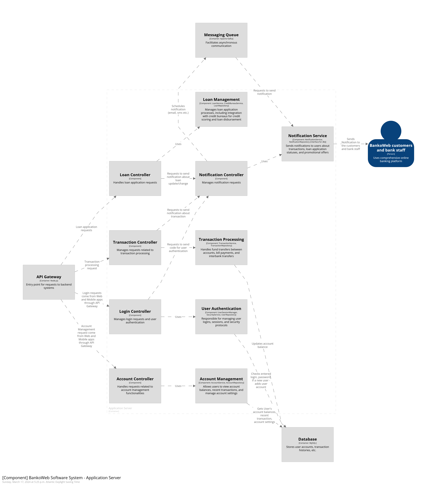

# Application Server Container Components

All communications with outside systems happen through the API Gateway container.

## Components:

1. **Loan Controller:**
   - Responsible for handling loan requests.
   - Utilizes the Loan Management component.
   - The Loan Management component provides additional functionality, such as checking the credit score of a user by making a request to credit bureaus outside the system.
   - Communication flow: Loan Management -> Loan Controller -> API Gateway -> Credit Bureaus.

2. **Transaction Controller:**
   - Manages requests related to transaction processing.
   - Utilizes the Transaction Processing component.
   - Handles fund transfers inside and outside the system.
   - Connected to the Notification Controller for handling notifications to bank staff and clients.
   - Communication flow: Transaction Processing -> Database.

3. **Login Controller:**
   - Responsible for user authentication.
   - Utilizes the Notification Controller to send notifications with codes for login purposes.
   - Uses the User Authentication component for managing user sessions, login, and security.
   - Communication flow: User Authentication -> Database.

4. **Account Controller:**
   - Handles requests related to account management functionalities.
   - Utilizes the Account Management component.
   - Allows users to view account balance, transactions, and manage settings.
   - Communication flow: Account Management -> Database.

## Connections:
- API Gateway: Acts as the entry point for all requests to the backend systems and integrates with external services.
- Database: Stores user data, transaction history, and account settings.

