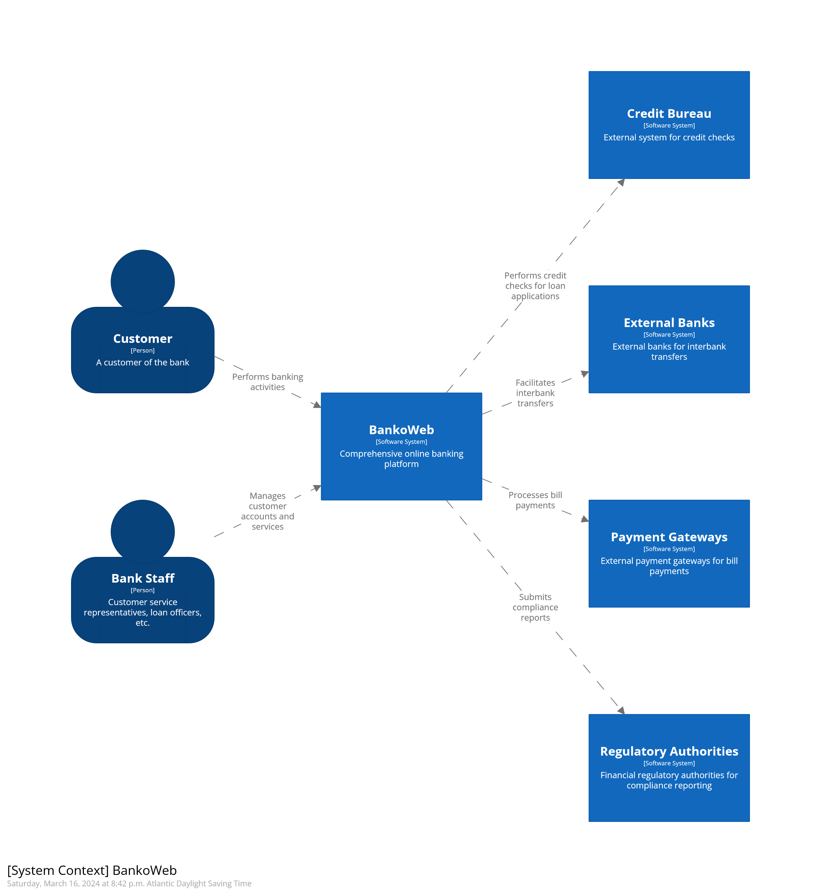
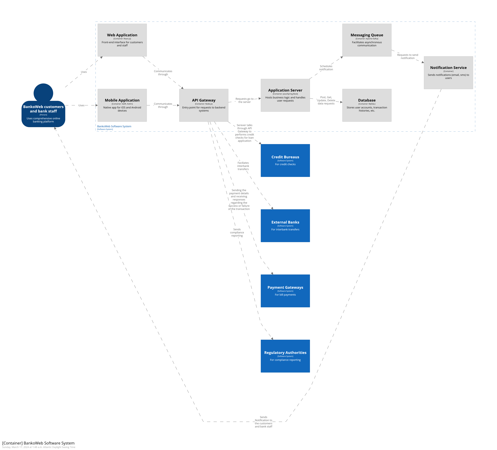
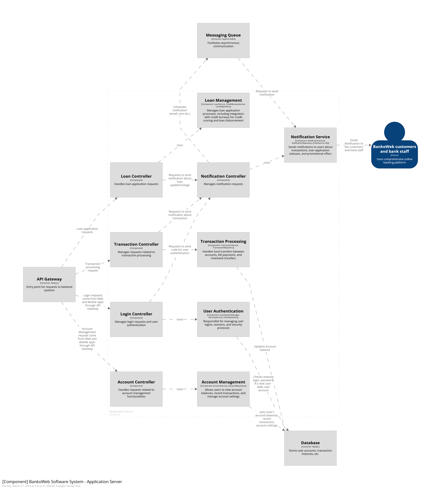

# C4-Model
Documenting Architecture using Structurizr

# BankoWeb External Communication

BankoWeb communicates with key external entities, including:

1. **Customers**: Users utilize BankoWeb to perform various banking activities.
   
2. **Bank Staff**: Bank staff members manage customer accounts and services within BankoWeb (including customer service representatives and loan officers).

3. **Credit Bureaus**: BankoWeb conducts credit checks for loan applications by interacting with Credit Bureaus.

4. **External Banks**: BankoWeb facilitates transfers and interactions with external banking institutions.

5. **Payment Gateways**: BankoWeb processes bill payments through Payment Gateway external systems.

6. **Regulatory Authorities**: BankoWeb submits compliance reports to regulatory authorities' systems.

# Containers Diagram

## Primary Elements
The containers within the software system and their interactions with external software systems.

- **Application Server**: Handles business logic and interacts with external systems through the API Gateway.
- **Database**: Stores, deletes, updates, and retrieves data for the Application Server and BAnkoWeb System.
- **Notification Service**: Sends email and SMS notifications for various events, such as password changes, account settings changes, authorizations, bill payments due, statement balances, and transactional information.
- **API Gateway**: Serves as the entry point for all requests to the backend systems and integrates with external services.
- **Web Application**: Front-end interface for customers and staff, accessible via desktop, mobile, and tablet devices.
- **Mobile Application**: Native applications for iOS and Android devices, offering similar functionalities as the web application.
- **Messaging Queue**: Facilitates asynchronous communication, especially for notification services and inter-service communication.

## Supporting Elements
People and software systems directly connected to the containers.

- Customers and bank staff interact with the Application Server through the API Gateway.
- If there is a transaction with external banks, the Application Server communicates with them through the API Gateway.

## Intended Audience
Technical individuals both inside and outside of the software development team, including software architects, developers, and operations/support staff.

>

# Application Server Container Components

All communications with outside systems happen through the API Gateway container.

## Components:

1. **Loan Controller:**
   - Responsible for handling loan requests.
   - Utilizes the Loan Management component.
   - The Loan Management component provides additional functionality, such as checking the credit score of a user by making a request to credit bureaus outside the system.
   - Communication flow: Loan Management -> Loan Controller -> API Gateway -> Credit Bureaus.

2. **Transaction Controller:**
   - Manages requests related to transaction processing.
   - Utilizes the Transaction Processing component.
   - Handles fund transfers inside and outside the system.
   - Connected to the Notification Controller for handling notifications to bank staff and clients.
   - Communication flow: Transaction Processing -> Database.

3. **Login Controller:**
   - Responsible for user authentication.
   - Utilizes the Notification Controller to send notifications with codes for login purposes.
   - Uses the User Authentication component for managing user sessions, login, and security.
   - Communication flow: User Authentication -> Database.

4. **Account Controller:**
   - Handles requests related to account management functionalities.
   - Utilizes the Account Management component.
   - Allows users to view account balance, transactions, and manage settings.
   - Communication flow: Account Management -> Database.

## Connections:
- API Gateway: Acts as the entry point for all requests to the backend systems and integrates with external services.
- Database: Stores user data, transaction history, and account settings.

